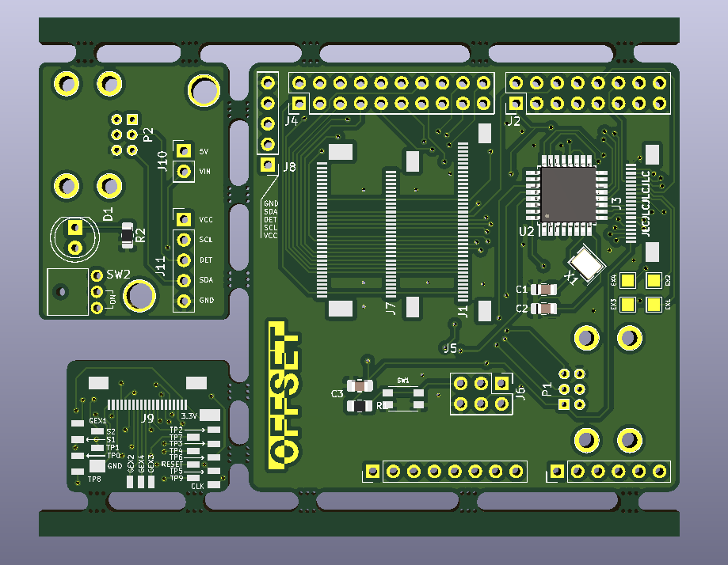

# gbaHD Shield
This is a shield for the [gbaHD project](https://github.com/zwenergy/gbaHD).  

Has the following features.
- Connects via female headers to the Edge board (shield)
- Has a FFC 40, 32 and 34 pin connector for GBA LCD connector.
- Has a FFC 20 pin connector for controls with a wire up board.
- Has a ATMEGA328p for using a SNES Classic connector to control the GBA.
- **Both FFC cables need to be opposite side** (Confirmation needed)

## Issues
- __*Version 2 Untested*__
- If you want a stable release, use [this branch](https://github.com/sanchezand/GBAHD-Shield/tree/version-1).

## Contributing
If you wish to contribute, see something wrong or want to add a feature please make a pull request or leave an issue!

## BOM
|Reference	|Value								|
|---------	|--------							|
|C1, C2		|22pF									|
|C3			|100nF								|
|R1			|10K ohm									|
|R2			|120 ohm (or change for your LED)	|
|D1			|5mm LED or TJ-L5FPTGCRMFCSFLC2R-A5	|
|U2			|ATMEGA328p-AU						|
|X1			|16MHz Crystal SMD-3225			|
|SW1			|XKB-TS-1185EC-C-D-B				|
|SW2			|XKB_XKB5858-Z-C					|
|J1			|JUSHUO_AFC01-S40FCC-00			|
|J2			|PinHeader 2x08 2.54mm			|
|J3, J9		|JUSHUO_AFC01-S20FCC-00			|
|J5			|JUSHUO_AFC07-S34FCC-00			|
|J7			|JUSHUO_AFC01-S32FCC-00			|
|J4			|PinHeader 2x10 2.54mm			|
|P1, P2		|Wii Expansion Port				|
|EXTRA 1		|PinHeader 1x08 2.54mm			|
|EXTRA 2		|PinHeader 1x06 2.54mm			|

## Programming the MCU
In order to program the MCU, you need an arduino to use as ISP.  
Use the following image to wire up an arduino to the board to program it.  
**I would also recomend not programming it while seated in the FPGA board.**
  
After wiring the board, follow this tutorial to flash the bootloader and the sketch to the board.  
[ICSP Tutorial](https://www.arduino.cc/en/pmwiki.php?n=Tutorial/ArduinoISP)

## Version 1 vs Version 2
- __Removed SNES connector for an classic controller connector__
- Made the PCB bigger and uses lower pins to improve stability
- Added future proof pins to the edge board.
- Panelized the board to lower the amount of PCBs needed
- Added an "Expansion" board to relocate the controller port and add an LED and power switch (which needs to desolder old switch and be wired to the Spartan board)
- Made the breakout board bigger and added more extra pins.
- Changed FFC connectors (except 34 pin) to use a clamp down connector.

## Images

